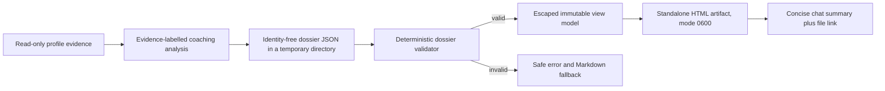

# LinkedIn Executive Career Dossier Design

**Status:** Approved final Superdesign draft; implementation-plan requested

**Objective:** Make a one-line LinkedIn audit request produce useful professional coaching: a concise chat decision and a complete, private, self-contained HTML dossier designed from the approved Superdesign direction.

**Authoritative visual reference:** [Dossier de Carrera - Minimalista Animado](https://superdesign.dev/teams/89932a06-b7b3-4e2f-b313-3ff133e38cec/projects/e2d729ab-0bca-4ea1-a12d-f5fcd071d91c?node=draft-variant-ab206e4e-8fe8-4ace-bf28-10cbee55bf2a)

The draft is authoritative for composition, density, palette, typography contrast, card treatment, and restrained animation. Its sample person, date, companies, traffic counts, message counts, offer rates, engagement values, target-role requirements, salary/P&L claims, market-demand labels, CDN dependencies, and accessibility violations are not product requirements. They are fabricated mock data and must never enter code, fixtures, or runtime output.

## Problem statement

The failed real-session output exposed internal coaching contracts instead of delivering coaching. It flattened verdict, evidence, drafts, authorization state, and routing metadata into one long technical response. The reader had no visual hierarchy, durable artifact, clear starting action, or easy way to distinguish observed evidence from a coaching judgment.

The current source improves the Markdown hierarchy, but its normal report still carries code-shaped values such as `GAP-*`, `ACTION-*`, `TIMEBOX-*`, internal evidence identifiers, and English enums. The existing JSON bundles are deliberately synthetic evaluation fixtures and cannot truthfully represent a live candidate. They must not become the runtime input for a real profile.

## Product decision

The default interactive LinkedIn-audit experience becomes:

1. inspect available evidence read-only;
2. build an identity-free runtime dossier document;
3. validate the document deterministically;
4. render one standalone HTML file;
5. return a short chat summary with the verdict, first action, first decision-changing question, and an absolute local file link.

The current Markdown report remains the compatibility path for evaluation, debug, and environments without local file execution. It is not the default client presentation when HTML artifact generation is available.

## Scope

### Included

- LinkedIn profile diagnostics only.
- Spanish and English rendering.
- Partial-evidence reports that mark unavailable dimensions as not evaluated.
- Profile photo and banner analysis expressed as text; no protected-trait inference and no image retention.
- Three ranked priorities.
- Headline, About-opening, and experience-bullet copy decisions.
- A seven-second recruiter reading, a first-conversation positioning bridge, decision-changing questions, and a private seven-day plan.
- Conditional aggregate analytics cards when the candidate explicitly authorizes dated private analytics for this local report.
- Conditional market and skill-gap cards only when the market-research module supplies dated vacancy evidence.
- Official methodology sources resolved from the versioned LinkedIn source registry.
- Offline HTML, local copy controls, print/PDF styles, accessibility, privacy, and deterministic validation.

### Excluded

- Editing LinkedIn, publishing, messaging, connecting, applying, uploading, scheduling, or sharing.
- Automated recruiter discovery or outreach from the report.
- Predictions of ranking, recruiter response, interviews, compensation, hiring, or time to hire.
- Market-demand claims without a separate dated vacancy-research workflow.
- Candidate comparison, candidate identity, contact data, raw profile text, profile URLs, raw private analytics, named profile visitors, confidential employer data, and local paths in the artifact.
- Rendering CV, interview, learning, or market modules through this schema in version 1.

## Client experience

### Chat layer

The chat response is at most 180 words and contains only:

- one-sentence verdict;
- the first private action;
- the first question whose answer would change the recommendation, when one exists;
- a clickable absolute link to the HTML artifact;
- a one-line statement that no LinkedIn action was performed.

The chat layer contains no score table, evidence IDs, internal field names, router receipt, source registry, or canonical rows.

### HTML reading path

The report uses the approved warm-paper, forest-green executive-dossier direction and presents:

1. utility header with report type, private/read-only state, and local Print / Save PDF;
2. executive verdict, confidence, evidence coverage, and “Start here” action in the dominant eight-column card;
3. seven-second recruiter scan in the adjacent four-column card;
4. exactly three priorities, each with problem, why it matters now, private action, timebox, and completion condition;
5. optional two-card analytics row, using either consented dated aggregates or an explicit unavailable/not-authorized state;
6. exactly seven dimensions: visual, headline, About, experience, skills, proof, and completeness;
7. separate photo and banner findings or honest unavailable states;
8. conditional minimalist skills/market comparison when dated vacancy evidence exists; otherwise a research-needed state with no radar values;
9. copy-review studio for headline, About opening, and one experience bullet;
10. “Do not change yet” claims that stay out until confirmed;
11. first-conversation bridge, without claiming an interview will occur;
12. at most three questions that can materially change a recommendation, with the first visually dominant;
13. private seven-day evidence and copy-review plan;
14. collapsed evidence, methodology, privacy, and diagnostic limits;
15. footer confirming that no LinkedIn action was executed.

Technical evidence references never appear in the main reading path. Evidence states render as natural language: Observed, Reported by you, Coaching judgment, Needs confirmation, and Unavailable.

## Runtime architecture

### Components

1. `executive-career-dossier-v1.schema.json`
   - Human- and agent-readable closed schema.
   - Exact keys, cardinalities, enums, length limits, and cross-field notes.

2. `validate_executive_career_dossier.py`
   - Standard-library-only loader and validator.
   - Validates structure, score math, evidence states, question/copy dependencies, privacy, action boundaries, and prohibited client language.
   - Emits deterministic path-based errors without raw sensitive values or tracebacks.

3. `render_executive_career_dossier.py`
   - Imports the validator and accepts only a valid dossier.
   - Converts it to an immutable view model.
   - Escapes every client-provided value.
   - Reads and inlines the approved CSS asset.
   - Writes the HTML atomically with mode `0600`.
   - Produces a deterministic safe chat summary in its success result.

4. `executive-career-dossier-v1.css`
   - Warm-paper and forest-green tokens from Superdesign.
   - Responsive layouts, visible focus, reduced-motion, and A4/Letter print rules.
   - No remote font, image, script, or CSS dependency.

5. `html-dossier.md`
   - Skill workflow for evidence intake, dossier composition, validation, rendering, temporary-file cleanup, response linking, and fallback behavior.

### Data flow



The temporary JSON input is deleted after success or failure. The HTML artifact is retained in the user workspace. Validation failure never leaves a partial HTML file.

## Runtime dossier contract

The top-level document has exactly these fields:

- `schema_version`: exactly `executive-career-dossier-v1`;
- `dossier_kind`: exactly `linkedin_profile_diagnostic`;
- `locale`: `es` or `en`;
- `evidence_as_of`: ISO date used for every freshness decision;
- `case_scope`: exactly `single_candidate`;
- `benchmarking`: exactly `disabled`;
- `focus`: bounded client-facing target-positioning sentence;
- `evidence_scope`;
- `evidence`;
- `claims`;
- `verdict`;
- `coverage`;
- `priorities`;
- `recruiter_scan`;
- `dimensions`;
- `visual_review`;
- `copy_blocks`;
- `do_not_change`;
- `screen_bridge`;
- `questions`;
- `seven_day_plan`;
- `analytics`;
- `market_context`;
- `methodology_source_categories`;
- `privacy`;
- `authorization`.

Unknown keys are rejected at every level. JSON size is capped at 256 KiB and nesting depth at 12.

### Evidence scope

`evidence_scope` records:

- inspection mode: `live_read_only`, `provided_material`, or `mixed`;
- ISO capture date;
- closed lists of inspected and unavailable LinkedIn sections;
- overall evidence confidence: `low`, `medium`, or `high`.

Inspected and unavailable sections must be disjoint. At least one section must be inspected before an HTML dossier is generated. With no inspectable or supplied evidence, the skill asks one intake question instead of producing an empty report.

### Evidence and claim ledgers

`evidence` is an identity-free local ledger. Every item has a dossier-local ID in `E-001` form, one state (`verified`, `candidate_reported`, `inferred`, or `unknown`), a closed LinkedIn section, a source kind, and a short paraphrase. Raw profile text, quotations, profile URLs, names, contact details, private identifiers, and confidential employer detail are prohibited.

`claims` contains dossier-local `C-001` IDs, a claim state, a short paraphrase, one or more evidence references, and public-use state `allowed`, `confirmation_required`, or `blocked`. A verified claim requires verified evidence; candidate-reported claims never become verified merely because they appear in a rewrite. Unknown or inferred claims cannot be `allowed`.

Priority, copy, hold, question, analytics, and market items reference only IDs from these ledgers. IDs remain internal to the temporary JSON and never render in the client-visible HTML.

### Verdict and coverage

`verdict` contains bounded human text for statement, rationale, and start-here action plus an evidence state. It cannot contain market-demand, platform-ranking, recruiter-response, interview, salary, hiring, or time-to-hire promises.

`coverage` is derived from the seven dimensions:

- total dimension count is exactly 7;
- evaluated count must match evaluated dimensions;
- scored and unscored weights use the existing domain weights: visual 15, headline 15, About 15, experience 20, skills 15, proof 10, completeness 10;
- an overall score may appear only when scored weight is at least 75;
- when present, the score is recomputed with half-up rounding and must match the submitted value;
- unavailable evidence never becomes zero;
- visual is evaluated only when both photo and banner have authorized visible evidence.

### Priorities

`priorities` contains exactly three unique ranks 1–3. Every priority contains:

- client-facing title;
- diagnosed problem;
- why it matters now;
- exact private action;
- integer timebox from 5 to 120 minutes;
- observable completion condition;
- evidence state;
- one or more evidence IDs and linked dimensions.

Code-only or placeholder values matching `GAP-*`, `ACTION-*`, `TIMEBOX-*`, `DONE-WHEN-*`, `TBD`, `TODO`, or equivalent localized placeholders are rejected.

### Recruiter scan, dimensions, and visual review

The recruiter scan has exactly three bounded statements: understood signal, ambiguity, and positioning bridge. It describes profile clarity only; it does not imitate a recruiter’s protected-trait judgment or predict an outcome.

Dimensions contain the seven canonical IDs exactly once. Evaluated dimensions require an integer score from 0–100, a reason, an evidence state, and evidence sections. Not-evaluated dimensions require a null score and an honest reason.

Photo and banner each have evaluated/not-evaluated state, finding, and optional private action. The validator rejects protected-trait inference, attractiveness claims, demographic proxies, and visual-outcome claims.

### Copy decisions and first-conversation bridge

`copy_blocks` contains exactly one block for headline, About opening, and experience bullet.

- `ready`: requires non-placeholder copy and supported evidence state;
- `requires_confirmation`: requires a decision-changing confirmation question;
- `omit`: requires null copy and a clear reason.

Every block includes why it works, claim IDs, evidence IDs, claim boundary, and evidence state. Copy is bounded by section-specific length limits and scanned for unsupported outcomes, executed external actions, credentials, contacts, URLs, paths, and internal IDs. Ready copy may use only allowed claims; confirmation copy requires an unconfirmed claim and its linked question; omitted copy is null.

The first-conversation bridge follows the same ready/confirmation/omit states. It helps the candidate explain positioning in a future screen; it never states or implies that a recruiter screen or interview has been obtained.

### Questions and seven-day plan

The report has zero to three questions. Ranks are ordered and unique. Every question names the recommendation or copy decision it can change. If any copy or screen-bridge block requires confirmation, at least one matching question is required. The chat uses only the first question.

The seven-day plan has one to seven unique day entries. Each action belongs to one of four private categories: confirm target, validate fact, review copy, or prepare proof. Every item includes a completion condition. External-action verbs and targets are rejected, including edit, publish, post, message, connect, apply, upload, share, schedule, or their Spanish equivalents.

### Optional analytics and market context

`analytics` is always present and has one of three states: `not_requested`, `unavailable`, or `observed_aggregate`.

- `not_requested` and `unavailable` require null measures and render an honest explanatory state.
- `observed_aggregate` requires explicit per-report consent, an ISO observation date, `raw_records_retained=false`, an observation window, and only aggregate counts or rates.
- Named visitors, company logos, company names, individual messages, message text, profile URLs, and raw analytics exports are always rejected.
- A rate requires its numerator and denominator, and is recomputed by the validator.
- Analytics are dated observations. They cannot be attributed to a profile change without a separately registered experiment and cannot alter the profile-quality score.

`market_context` is always present and has `not_researched` or `dated_vacancy_evidence` state.

- `not_researched` requires no role-demand, skill-gap, salary, company, or market-strength values and renders a research-needed state.
- `dated_vacancy_evidence` requires the target geography, arrangement, research date, vacancy sample count, one to three target roles, and evidence references produced by `research-target-job-market`.
- The market comparison is visually separate from the LinkedIn scorecard and cannot change its score.
- Radar or comparison graphics render only supplied, validated dimensions; decorative or fabricated values are prohibited.

### Sources, privacy, and authorization

The dossier supplies only closed methodology-source category names. The renderer resolves current public title and URL values from `linkedin_source_registry.json`; arbitrary URLs are never accepted in the runtime JSON. Sources support methodology only and cannot be presented as proof of an individual outcome.

`privacy` is fixed to:

- private report: true;
- candidate identity included: false;
- contact data included: false;
- raw profile retained: false;
- raw private analytics included: false;
- aggregate analytics included: true only when `analytics.state=observed_aggregate` and explicit report consent is recorded.

`authorization` is fixed to external actions not authorized and action state not executed.

The validator recursively rejects emails, phone numbers, profile URLs, arbitrary URLs, local paths, credential-shaped values, private analytics aliases, raw-profile aliases, candidate IDs, synthetic fixture IDs, secret-looking assignments, protected-trait visual inference, completed external-action claims, and employment or platform outcome guarantees.

## HTML output contract

- One `<!doctype html>` document with `lang` matching the dossier locale.
- One H1 and logical H2/H3 structure with `header`, `main`, `nav`, `aside`, and `footer` landmarks where appropriate.
- All text escaped with the standard HTML escaping rules.
- No `innerHTML` assignment from report data.
- Content Security Policy denies remote resources; CSS and JavaScript are inline.
- No `<script src>`, `<link rel=stylesheet>`, `@import`, remote image, analytics, beacon, form submission, or network request.
- Copy buttons read text from named local DOM elements, use the Clipboard API when available, and fall back locally.
- Print invokes only `window.print()`.
- No candidate name, profile URL, contact detail, raw profile text, evidence ID, internal enum, code-only contract value, local path, or private analytics appears in visible text or HTML comments.
- Stable generic title and filename; no identity in the filename.
- Output is atomically written and permissioned `0600`; an existing file is not overwritten without an explicit `--force` flag.

## Visual and accessibility contract

- Warm paper `#F6F4EE`, primary ink `#1A1A1A`, forest `#173E30`, muted paper `#E2DDD6`, coral `#D96C52`, and gold `#BE9338`.
- Use a local/system serif stack for editorial headings and a local/system sans-serif stack for body text; never load the draft's Google Fonts.
- Ultra-clean white cards, one-pixel low-contrast forest borders, no shadows, no glass, no stock photos, and no decorative data.
- Preserve the draft's 12-column desktop composition, dotted paper grid, restrained negative space, compact header, serif italic report title, dominant verdict card, adjacent scan card, and tightly aligned analytic cards.
- Preserve 0.6-second fade-in and one-to-two-pixel hover lift only as progressive enhancement. Disable both under `prefers-reduced-motion` and in print.
- Progress fills and minimalist SVG graphics are allowed only for validated numeric values. They always include visible text/table equivalents and never animate from fabricated defaults.
- No CSS gradients, even where the draft contains them; use flat forest, coral, gold, and muted fills.
- Verdict, recruiter scan, and compact coverage/priority signals fit within the first desktop viewport at 1440×900.
- Clean reflow at 360, 768, and 1440 CSS pixels and 200% zoom without page-level horizontal scrolling.
- Body text at least 16px and metadata at least 13px with 1.5 line height and approximately 72-character measure; do not copy the draft's 9–12px body labels.
- WCAG AA contrast, visible keyboard focus, and 44×44px interactive targets.
- Status is communicated with text and shape, never color alone.
- `prefers-reduced-motion` removes nonessential transitions.
- A4 and Letter print styles hide controls, retain verdict and limits, prevent card clipping where practical, and avoid orphaned headings.

## CLI behavior

Validation:

```text
python3 plugins/job-search-coach/scripts/validate_executive_career_dossier.py INPUT.json
```

Rendering:

```text
python3 plugins/job-search-coach/scripts/render_executive_career_dossier.py INPUT.json --output OUTPUT.html
```

On success, the renderer prints one small JSON object containing only the absolute artifact path and the safe chat summary. Validation errors exit 2; I/O errors exit 3. Errors are sorted, deduplicated, path-based, and contain no raw field values. No traceback is emitted for expected malformed input.

## Skill behavior

For a normal LinkedIn audit with local file tools:

1. read the root and LinkedIn skills;
2. inspect only authorized visible evidence;
3. ask no preliminary question when enough evidence is available;
4. mark unavailable sections rather than scoring them as zero;
5. create the dossier JSON in a mode-700 temporary directory;
6. validate, render, and remove the temporary input;
7. return the concise chat summary and clickable HTML link;
8. ask exactly one essence question when a decision remains blocked;
9. keep every external action unexecuted.

If validation fails, repair the dossier once from the reported field paths and retry. A second failure uses the current concise Markdown client report and says that the HTML artifact could not be generated. It never exposes the rejected JSON or internal validation values.

Debug, eval, and explicit detail modes retain the current Markdown/canonical appendix workflow. An environment without filesystem or command execution uses the Markdown fallback immediately.

## Testing strategy

### Contract tests

- exact top-level and nested keys;
- canonical cardinalities and ordering;
- score/coverage recomputation and not-evaluated semantics;
- priority, copy, question, plan, privacy, source, and authorization cross-field rules;
- malformed objects, deep JSON, duplicate keys, Unicode controls, and oversized input;
- privacy, credential, protected-trait, external-action, outcome-guarantee, internal-ID, and code-only value mutations;
- safe technical and career-copy negative controls to prevent overblocking.

### Renderer tests

- valid Spanish and English dossiers render;
- deterministic output for identical input;
- all free text is escaped under adversarial HTML/JavaScript payloads;
- output has no remote dependency or automatic network surface;
- exactly three priorities, seven dimensions, three copy blocks, and at most three questions appear;
- unavailable dimensions show “Not evaluated”/“No evaluado” and no zero;
- internal keys, IDs, enums, and code-only values never appear in visible text;
- source links come only from the registry;
- chat summary is at most 180 words and contains verdict, first action, optional first question, and no internal metadata;
- output is atomic, non-overwriting by default, and mode `0600`.

### Skill and pressure tests

- the real one-line prompt shape routes to concise chat plus HTML by default;
- a no-guidance control reproduces the old technical-output failure;
- five or more fresh-context pressure runs converge on the client-first artifact behavior;
- explicit normal mode cannot be coerced into raw/debug output;
- insufficient evidence produces one useful question instead of invented claims;
- live inspection remains read-only and never authorizes profile actions.

### Render QA

- automated semantic checks plus manual keyboard, focus, zoom, and status-comprehension review;
- screenshots at 360, 768, and 1440 pixels;
- Letter and A4 print/PDF inspection for clipping and orphaned headings;
- offline open, internal anchors, copy buttons, and print control verified without a local server;
- privacy scan over input, HTML source, visible text, screenshot names, and test artifacts.
- conditional analytics screenshots prove both unavailable and explicitly consented aggregate states without named visitors;
- market cards prove both not-researched and dated-vacancy states, with no market values in the former.

## Acceptance criteria

1. The one-line LinkedIn audit prompt produces a short chat response and a clickable standalone HTML report when evidence and local tools are available.
2. A reader can identify the verdict, first action, primary blocker, and missing evidence within 60 seconds.
3. The first desktop viewport contains verdict, start action, and all three priority summaries.
4. Visible-text scans find zero snake_case, raw `key=value` rows, internal IDs, fixture codes, profile URLs, contact details, raw analytics, named visitors, local paths, or secret-looking assignments.
5. Exactly three priorities, seven dimensions, and three copy decisions render, with honest not-evaluated states.
6. The report includes useful copy or an explicit confirmation/omit decision for every copy section.
7. No external action, outcome promise, protected-trait inference, or unsupported market claim passes validation.
8. The artifact opens offline, uses no remote dependencies, works with keyboard, reflows at required widths, and prints on A4 and Letter without clipping.
9. Existing Markdown evaluation/debug contracts and current full repository tests remain green.
10. Analytics and market panels never fabricate mock data: they show validated evidence or an explicit unavailable/not-researched state.
11. Installation is a separate, explicitly authorized step; source changes do not silently mutate the installed cache.

## Future opportunities outside version 1

- Compare two private dossier versions to show which evidence or copy changed.
- Render CV and interview artifacts through separate, purpose-built schemas after their contracts reach the same maturity.
- Add an opt-in job-search experiment dashboard only after real outcome data exists; never infer causality from profile changes alone.
- Add read-only recruiter-market research as a separate module with dated vacancy evidence; never mix it into the profile-quality score.
